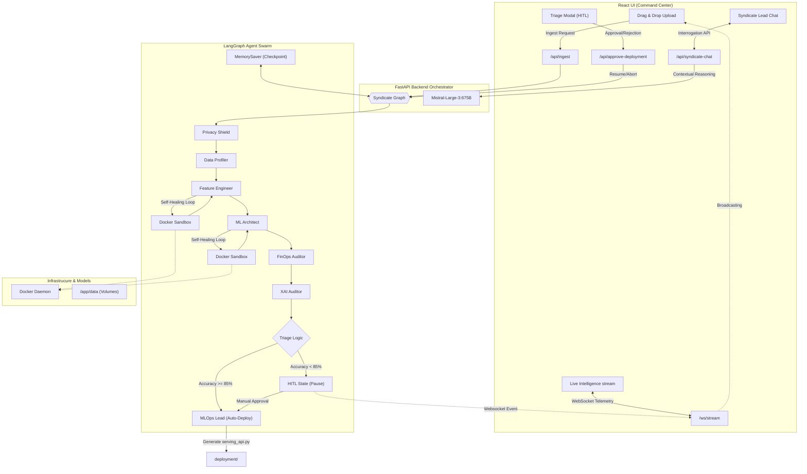

# SyndicateML: System Architecture

The following diagram illustrates the autonomous multi-agent orchestration within SyndicateML, leveraging LangGraph, Mistral AI, and Docker.

## Key Architectural Principles:
1. **Event-Driven**: The system uses WebSockets for real-time telemetry, ensuring the user is never out of the loop.
2. **Privacy-First**: The `Privacy Shield` is the first line of defense, scanning and masking PII before any further analysis.
3. **Self-Healing**: Agents utilize an isolated `Docker Sandbox` for code execution, automatically retrying and refining code upon failure.
4. **HITL Triage**: A safety threshold ensures that only high-performing models proceed to production without manual sign-off.
5. **Contextual Explainability**: The `XAI Auditor` and `Syndicate Lead Chat` provide granular transparency into every automated decision.
